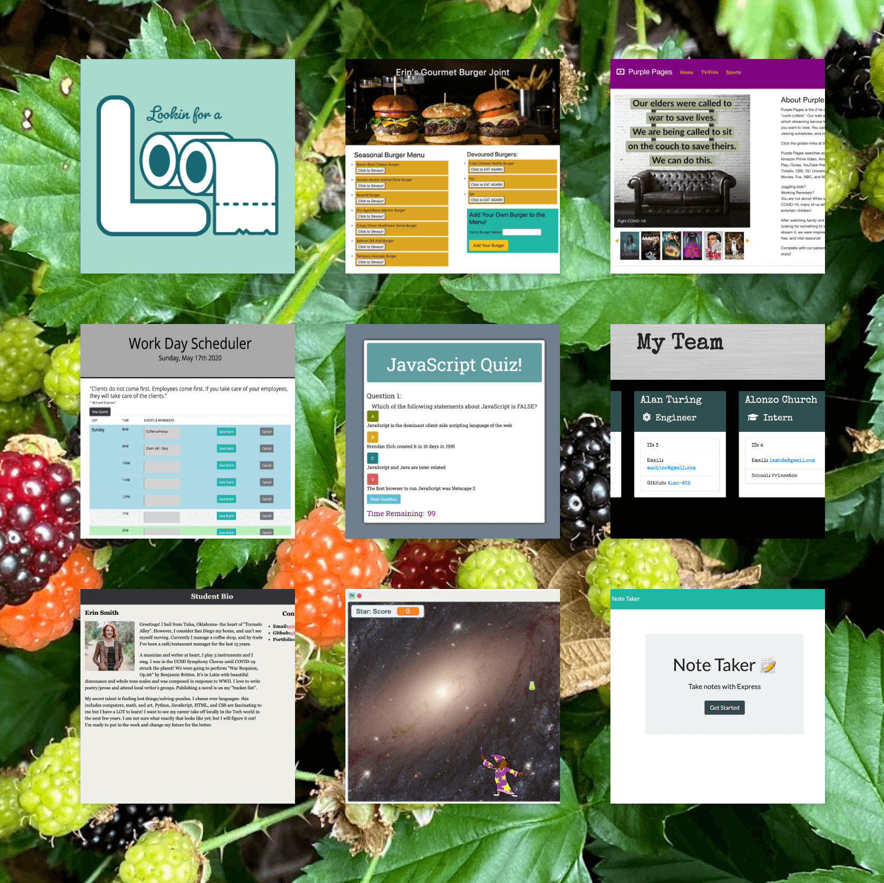

# react-portfolio
  
This React Portfolio includes new work from my recent projects, updated contact information, resume and working links to reach me through many methods, including a SendGrid API for email! It utilizes React-Router, Components, axios, and dynamic rendering.  

The About page includes a Bio and links in the header and footer (LinkedIn, Instagram, Github).

The Portfolio page includes 9 of my current favorite projects with links and printable PDF of my resume. The flip tiles are rendered using screenshots from each actual project.  The tiles include clickable buttons to both the Github Repo and live sites.

The portfolio contains a Full-Stack app for Finding the Loo, a Burger app, Purple Pages ( media streaming guide), Scheduler with quote API, a Timed JavaScript Quiz, Team Generator, Current Resume page, Virus Video Game, and a NotePad app! I've included a React-Router and Mobile-Responsiveness fixes.

[Link to project](https://erin-smith.github.io/react-portfolio/)

    

## Contributing   
 If you would like to contribute to this project or have feedback, please contact me below in the Questions Section.  

***
 **Contributors:** erin-smith   
***  

  

## Questions:  
  

  If you have any questions about the repo, [open an issue](https://github.com/erin-smith/react-portfolio/issues/new) or contact me:  

* [My GitHub Profile](http://github.com/erin-smith)
*   

***

